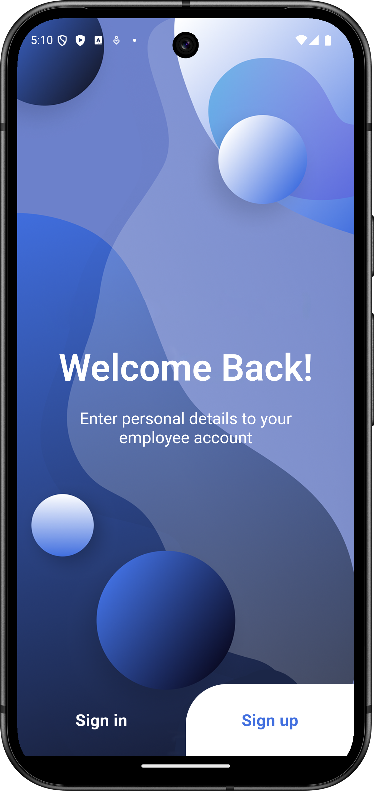
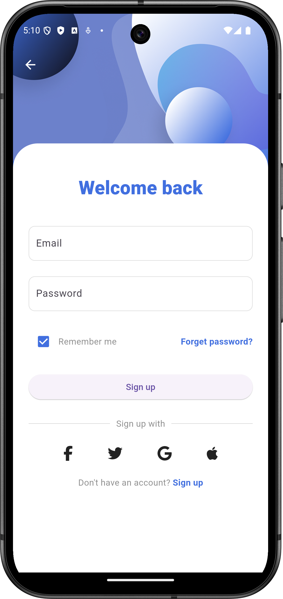
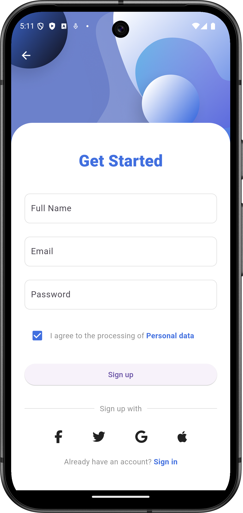

# 🚀 Flutter UI - Auth Screens

Bu proje, modern ve şık bir **giriş & kayıt ekranı** kullanıcı arayüzü içerir. Uygulama **Flutter** ile geliştirilmiş olup, üç ana ekrandan oluşmaktadır: **Welcome Back (Karşılama)**, **Sign In (Giriş Yap)** ve **Sign Up (Kayıt Ol)**.

## 🌟 Özellikler

✅ **Karşılama Ekranı** – Kullanıcıyı sıcak bir şekilde karşılar.  
✅ **Sign In (Giriş Yap)** – Kullanıcıların hesaplarına giriş yapmalarını sağlar.  
✅ **Sign Up (Kayıt Ol)** – Yeni kullanıcıların hesap oluşturmalarına imkan tanır.                                                                                                        
✅ **Temiz ve Minimalist Kod Yapısı** – Kolay okunabilir ve genişletilebilir.

## 📸 Ekran Görüntüleri

<p align="center">
  
  
  
</p>

## 🚀 Kurulum & Çalıştırma

1️⃣ Bu depoyu klonlayın:  
   ```bash
   git clone https://github.com/gizem-ky/Flutter-UI-Auth-Screens.git
   cd Flutter-UI-Auth-Screens
   ```
2️⃣ Bağımlılıkları yükleyin:  
   ```bash
   flutter pub get
   ```
3️⃣ Uygulamayı çalıştırın:  
   ```bash
   flutter run
   ```
